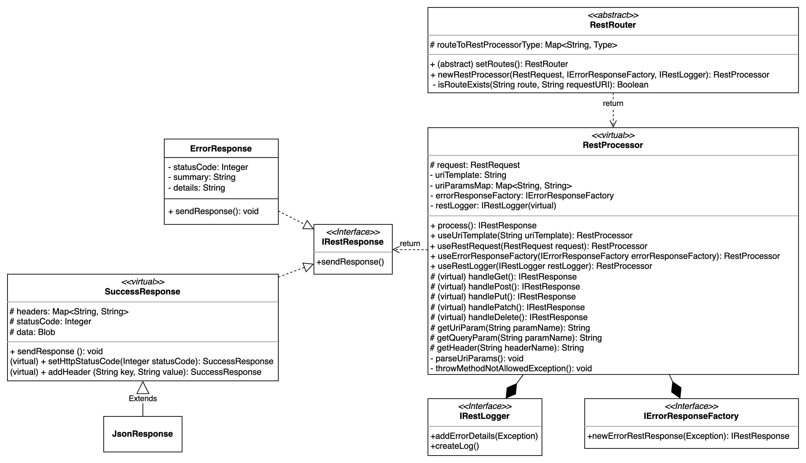

- [`Overview`](#overview)
- [`Constants`](#constants)
  - [HTTP Status Codes](#http-status-codes)
  - [HTTP Headers](#http-headers)
  - [Content Types](#content-types)
  - [Error Messages](#error-messages)
- [`Interfaces`](#interfaces)
  - [libak_RestFramework.IRestResponse](#restframeworkirestresponse)
  - [libak_RestFramework.IErrorResponseFactory](#restframeworkierrorresponsefactory)
  - [libak_RestFramework.IRestLogger](#restframeworkirestlogger)
- [`Public static methods`](#public-static-methods)
    - [`handleRequest(Type routerType)`](#handlerequesttype-routertype)
    - [`handleRequest(Type routerType, Type loggerType)`](#handlerequesttype-routertype-type-loggertype)
    - [`handleRequest(Type routerType, Type loggerType, Type errorResponseFactoryType)`](#handlerequesttype-routertype-type-loggertype-type-errorresponsefactorytype)
- [`libak_RestProcessor class`](#restprocessor-class)
  - [Constructors](#constructors)
    - [`libak_RestProcessor()`](#restprocessor)
  - [Public Methods](#public-methods)
    - [`process()`](#process)
    - [`useUriTemplate(String uriTemplate)`](#useuritemplatestring-uritemplate)
    - [`useRestRequest(RestRequest request)`](#userestrequestrestrequest-request)
    - [`useErrorResponseFactory(libak_RestFramework.IErrorResponseFactory errorResponseFactory)`](#useerrorresponsefactoryrestframeworkierrorresponsefactory-errorresponsefactory)
    - [`useRestLogger(libak_RestFramework.IRestLogger restLogger)`](#userestloggerrestframeworkirestlogger-restlogger)
  - [Virtual Methods](#virtual-methods)
    - [`handleGet()`](#handleget)
    - [`handlePost()`](#handlepost)
    - [`handlePut()`](#handleput)
    - [`handlePatch()`](#handlepatch)
    - [`handleDelete()`](#handledelete)
  - [Protected Methods](#protected-methods)
    - [`getUriParam(String paramName)`](#geturiparamstring-paramname)
    - [`getQueryParam(String paramName)`](#getqueryparamstring-paramname)
    - [`getHeader(String headerName)`](#getheaderstring-headername)
  - [Private Methods](#private-methods)
    - [`parseUriParams()`](#parseuriparams)
    - [`throwMethodNotAllowedException()`](#throwmethodnotallowedexception)
- [`libak_RestRouter class`](#restrouter-class)
  - [Abstract methods](#abstract-methods)
    - [`setRoutes()`](#setroutes)
  - [Public methods](#public-methods-1)
    - [`newRestProcessor(RestRequest request, libak_RestFramework.IErrorResponseFactory errorResponseFactory, libak_RestFramework.IRestLogger restLogger)`](#newrestprocessorrestrequest-request-restframeworkierrorresponsefactory-errorresponsefactory-restframeworkirestlogger-restlogger)
  - [Private Methods](#private-methods-1)
    - [`isRouteExists(String route, String requestURI)`](#isrouteexistsstring-route-string-requesturi)
- [`libak_ErrorResponseFactory class`](#errorresponsefactory-class)
  - [Public Methods](#public-methods-2)
    - [`newErrorRestResponse(Exception exc)`](#newerrorrestresponseexception-exc)
- [`libak_SuccessResponse class`](#successresponse-class)
  - [Constructors](#constructors-1)
    - [`libak_SuccessResponse(String data)`](#successresponsestring-data)
    - [`libak_SuccessResponse(Blob data)`](#successresponseblob-data)
    - [`libak_SuccessResponse(Integer statusCode, String data)`](#successresponseinteger-statuscode-string-data)
    - [`libak_SuccessResponse(Integer statusCode, Blob data)`](#successresponseinteger-statuscode-blob-data)
  - [Public methods](#public-methods-3)
    - [`setHttpStatusCode(Integer statusCode)`](#sethttpstatuscodeinteger-statuscode)
    - [`addHeader(String key, String value)`](#addheaderstring-key-string-value)
    - [`sendResponse()`](#sendresponse)
- [`libak_JsonResponse class`](#jsonresponse-class)
  - [Constructors](#constructors-2)
    - [`libak_JsonResponse(String data)`](#jsonresponsestring-data)
    - [`libak_JsonResponse(Object data)`](#jsonresponseobject-data)
    - [`libak_JsonResponse(Integer statusCode, String data)`](#jsonresponseinteger-statuscode-string-data)
    - [`libak_JsonResponse(Integer statusCode, Object data)`](#jsonresponseinteger-statuscode-object-data)
  - [Public Methods](#public-methods-4)
    - [`addHeader(String key, String value)`](#addheaderstring-key-string-value-1)
    - [`sendResponse()`](#sendresponse-1)
- [`libak_ErrorResponse class`](#errorresponse-class)
  - [Constructors](#constructors-3)
    - [`libak_ErrorResponse(Integer statusCode, String summary, String details)`](#errorresponseinteger-statuscode-string-summary-string-details)
    - [`libak_ErrorResponse(Integer status, String summary, Exception exc)`](#errorresponseinteger-status-string-summary-exception-exc)
    - [`libak_ErrorResponse(Integer status, Exception exc)`](#errorresponseinteger-status-exception-exc)
  - [Public Methods](#public-methods-5)
    - [`sendResponse()`](#sendresponse-2)
- [`Custom Exceptions`](#custom-exceptions)
- [`Demo of usage`](#demo-of-usage)

## `Overview`

The `libak_RestFramework` class provides a structured framework for building RESTful web services in Salesforce Apex. It includes interfaces for routing, response handling, error management, and logging, along with core components for processing RESTful requests.

## `Constants`

### HTTP Status Codes

- `libak_RestFramework.HTTP_CODE_OK` (Integer): HTTP status code for a successful request (200).
- `libak_RestFramework.HTTP_CODE_BAD_REQUEST` (Integer): HTTP status code for a bad request (400).
- `libak_RestFramework.HTTP_CODE_NOT_FOUND` (Integer): HTTP status code for a not found resource (404).
- `libak_RestFramework.HTTP_CODE_METHOD_NOT_ALLOWED` (Integer): HTTP status code for a method not allowed (405).
- `libak_RestFramework.HTTP_CODE_INTERNAL_SERVER_ERROR` (Integer): HTTP status code for an internal server error (500).

### HTTP Headers

- `libak_RestFramework.HEADER_NAME_CONTENT_TYPE` (String): The name of the HTTP header for specifying content type.

### Content Types

- `libak_RestFramework.CONTENT_TYPE_APPLICATION_JSON` (String): Content type for JSON data.
- `libak_RestFramework.CONTENT_TYPE_APPLICATION_PDF` (String): Content type for PDF data.

### Error Messages

- `libak_RestFramework.ERROR_MESSAGE_INTERNAL_SERVER_ERROR` (String): Default error message for internal server errors.
- `libak_RestFramework.ERROR_MESSAGE_INVALID_URI` (String): Error message for invalid URIs.
- `libak_RestFramework.ERROR_MESSAGE_METHOD_NOT_ALLOWED` (String): Error message for unsupported HTTP methods.

## `Interfaces`

### libak_RestFramework.IRestResponse

The `libak_RestFramework.IRestResponse` interface defines a method for sending REST responses.

- `sendResponse(): void`: Sends the REST response.

### libak_RestFramework.IErrorResponseFactory

The `libak_RestFramework.IErrorResponseFactory` interface defines a method for creating error responses.

- `newErrorRestResponse(Exception exc): libak_RestFramework.IRestResponse`: Creates a new error response based on the given exception.

### libak_RestFramework.IRestLogger

The `libak_RestFramework.IRestLogger` interface defines methods for logging REST-related information.

- `addErrorDetails(Exception exc): void`: Adds error details to the logger.
- `createLog(): void`: Creates a log.

## `Public static methods`

#### `handleRequest(Type routerType)`

Handles an incoming REST request using the specified router.

- Parameters:
  - `routerType` (Type): The type of the router to use for routing the request.

#### `handleRequest(Type routerType, Type loggerType)`

Handles an incoming REST request using the specified router and logger.

- Parameters:
  - `routerType` (Type): The type of the router to use for routing the request.
  - `loggerType` (Type): The type of the logger to use for logging REST-related information (optional, can be null).
#### `handleRequest(Type routerType, Type loggerType, Type errorResponseFactoryType)`

Handles an incoming REST request using the specified router, logger, and error response factory.

- Parameters:
  - `routerType` (Type): The type of the router to use for routing the request.
  - `loggerType` (Type): The type of the logger to use for logging REST-related information (optional, can be null).
  - `errorResponseFactoryType` (Type): The type of the error response factory to use for creating error responses (optional, can be null).

---

## `libak_RestProcessor class`

The `libak_RestProcessor` class serves as the base class for implementing specific REST processors. It includes methods for handling different HTTP methods, parsing URI parameters, and managing errors.

Certainly, here's the completion of the public methods section for the `libak_RestProcessor` class:

### Constructors

#### `libak_RestProcessor()`

Creates a new instance of the `libak_RestProcessor` class.

### Public Methods

#### `process()`

Processes the incoming REST request by handling different HTTP methods and managing errors.

This method is the entry point for processing incoming REST requests. It dynamically dispatches the request to the appropriate handler based on the HTTP method (GET, POST, PUT, PATCH, DELETE). If an unsupported HTTP method is received, it throws a `libak_RestFramework.MethodNotAllowedException`.

- Returns: An instance of `libak_RestFramework.IRestResponse` representing the response to the REST request.
- Throws: `libak_RestFramework.MethodNotAllowedException` - If the incoming HTTP method is not supported for this resource.

#### `useUriTemplate(String uriTemplate)`

Sets the URI template for this `libak_RestProcessor`. The URI template defines the expected structure of the incoming URI, including any URI parameters.

- Parameters:
  - `uriTemplate` (String): The URI template to set, in the format "/service/resource/:paramName". The colon (:) is used to denote URI parameters, and the parameter name is used as the key for mapping URI values.
- Returns: The current `libak_RestProcessor` instance with the URI template set.

#### `useRestRequest(RestRequest request)`

Sets the REST request for this `libak_RestProcessor`. The REST request contains information about the incoming HTTP request, including the HTTP method, headers, and request parameters.

- Parameters:
  - `request` (RestRequest): The `RestRequest` object representing the incoming HTTP request.
- Returns: The current `libak_RestProcessor` instance with the specified REST request set.

#### `useErrorResponseFactory(libak_RestFramework.IErrorResponseFactory errorResponseFactory)`

Sets the error response factory for this `libak_RestProcessor`.

- Parameters:
  - `errorResponseFactory` (libak_RestFramework.IErrorResponseFactory): The error response factory to use.
- Returns: The current `libak_RestProcessor` instance.

#### `useRestLogger(libak_RestFramework.IRestLogger restLogger)`

Sets the REST logger for this `libak_RestProcessor`.

- Parameters:
  - `restLogger` (libak_RestFramework.IRestLogger): The REST logger to use.
- Returns: The current `libak_RestProcessor` instance.

### Virtual Methods

The `libak_RestProcessor` class includes a set of virtual methods for handling specific HTTP methods. These methods can be overridden in subclasses to implement custom request handling logic. If a virtual method is called without being overridden in a subclass, it will throw a `libak_RestFramework.MethodNotAllowedException` indicating that the corresponding HTTP method is not supported for this resource.

#### `handleGet()`

Handles the HTTP GET method for processing REST requests.

- Returns: An instance of `libak_RestFramework.IRestResponse` representing the response to the GET request.

#### `handlePost()`

Handles the HTTP POST method for processing REST requests.

- Returns: An instance of `libak_RestFramework.IRestResponse` representing the response to the POST request.

#### `handlePut()`

Handles the HTTP PUT method for processing REST requests.

- Returns: An instance of `libak_RestFramework.IRestResponse` representing the response to the PUT request.

#### `handlePatch()`

Handles the HTTP PATCH method for processing REST requests.

- Returns: An instance of `libak_RestFramework.IRestResponse` representing the response to the PATCH request.

#### `handleDelete()`

Handles the HTTP DELETE method for processing REST requests.

- Returns: An instance of `libak_RestFramework.IRestResponse` representing the response to the DELETE request.

### Protected Methods

The `libak_RestProcessor` class includes a set of protected methods for internal use.

#### `getUriParam(String paramName)`

Retrieves the value of a URI parameter by its name. URI parameters are placeholders in the URI template specified when configuring the `libak_RestProcessor`.

- Parameters:
  - `paramName` (String): The name of the URI parameter to retrieve.
- Returns: The value of the URI parameter if found, or `null` if the parameter is not present.

#### `getQueryParam(String paramName)`

Retrieves the value of a query parameter by its name from the current REST request. Query parameters are key-value pairs in the request's query string.

- Parameters:
  - `paramName` (String): The name of the query parameter to retrieve.
- Returns: The value of the query parameter if found, or `null` if the parameter is not present.

#### `getHeader(String headerName)`

Retrieves the value of an HTTP header by its name from the current REST request. HTTP headers are key-value pairs in the request's header section.

- Parameters:
  - `headerName` (String): The name of the HTTP header to retrieve.
- Returns: The value of the HTTP header if found, or `null` if the header is not present.

### Private Methods

#### `parseUriParams()`

Parses the URI string based on the configured URI template and prepares a map of URI parameters. This method is automatically called when URI parameters need to be accessed.

- Throws: `libak_RestFramework.InvalidUriException` - If the URI structure does not match the expected template.

#### `throwMethodNotAllowedException()`

Throws a `libak_RestFramework.MethodNotAllowedException` with a message indicating that the current HTTP method is not allowed for the requested resource.

- Throws: `libak_RestFramework.MethodNotAllowedException` - Thrown to indicate that the HTTP method is not allowed for the resource.

---

## `libak_RestRouter class`

The `libak_RestRouter` class is responsible for routing incoming REST requests to the appropriate `libak_RestProcessor` based on the requested URI. It maintains a mapping of routes to `libak_RestProcessor` types and dynamically creates instances of the appropriate processor.
Certainly, here's the API reference documentation for the `libak_RestRouter` class:

### Abstract methods

#### `setRoutes()`

Sets the routes for the `libak_RestRouter`. Implement this method to define the routing logic. Implement to set the value for the `routeToRestProcessorType` property as <route>:<libak_RestProcessor type>

- Returns: The current `libak_RestRouter` instance.

### Public methods

#### `newRestProcessor(RestRequest request, libak_RestFramework.IErrorResponseFactory errorResponseFactory, libak_RestFramework.IRestLogger restLogger)`

Creates a new `libak_RestProcessor` instance for handling the incoming REST request with a custom error response factory and REST logger. This method dynamically selects the appropriate `libak_RestProcessor` based on the requested URI.

- Parameters:
  - `request` (RestRequest): The `RestRequest` object representing the incoming HTTP request.
  - `errorResponseFactory` (libak_RestFramework.IErrorResponseFactory): The custom error response factory to use for generating error responses.
  - `restLogger` (libak_RestFramework.IRestLogger): The custom REST logger to use for logging REST-related information.
- Returns: A new `libak_RestProcessor` instance configured to handle the specified REST request with custom error handling and logging.
- Throws: `libak_RestFramework.InvalidUriException` - If the requested URI does not match any defined routes.

### Private Methods

#### `isRouteExists(String route, String requestURI)`

Checks if a route exists based on the requested URI.

- Parameters:
  - `route` (String): The route pattern to check.
  - `requestURI` (String): The requested URI.
- Returns: `true` if the route exists for the given URI, `false` otherwise.

---

## `libak_ErrorResponseFactory class`

The `libak_ErrorResponseFactory` class is responsible for creating error responses based on exceptions. It maps exception types to appropriate HTTP status codes and error messages.

### Public Methods

#### `newErrorRestResponse(Exception exc)`

Creates a new error response for the given exception.

- Parameters:
  - `exc` (Exception): The exception for which to create an error response.
- Returns: An error response based on the exception.

---

## `libak_SuccessResponse class`

The `libak_SuccessResponse` class represents a successful REST response. It allows developers to construct responses with custom data, status codes, and headers.

### Constructors

#### `libak_SuccessResponse(String data)`

Constructs a new `libak_SuccessResponse` with the provided data as a `String`.

- Parameters:
  - `data` (String): The data to include in the response.

#### `libak_SuccessResponse(Blob data)`

Constructs a new `libak_SuccessResponse` with the provided data as a `Blob`.

- Parameters:
  - `data` (Blob): The data to include in the response.

#### `libak_SuccessResponse(Integer statusCode, String data)`

Constructs a new `libak_SuccessResponse` with the specified status code and data as a `String`.

- Parameters:
  - `statusCode` (Integer): The HTTP status code for the response.
  - `data` (String): The data to include in the response.

#### `libak_SuccessResponse(Integer statusCode, Blob data)`

Constructs a new `libak_SuccessResponse` with the specified status code and data as a `Blob`.

- Parameters:
  - `statusCode` (Integer): The HTTP status code for the response.
  - `data` (Blob): The data to include in the response.

### Public methods

#### `setHttpStatusCode(Integer statusCode)`

Sets the HTTP status code for the response.

- Parameters:
  - `statusCode` (Integer): The HTTP status code to set.
- Returns: The current `libak_SuccessResponse` instance.

#### `addHeader(String key, String value)`

Adds a header to the response.

- Parameters:
  - `key` (String): The header key.
  - `value` (String): The header value.
- Returns: The current `libak_SuccessResponse` instance.

#### `sendResponse()`

Sends the success response with the configured status code, data, and headers. It sets the HTTP status code, response body, and headers in the RestContext's response object.

---

## `libak_JsonResponse class`

The `libak_JsonResponse` class represents a successful REST response with JSON data. It extends the `libak_SuccessResponse` class and provides convenience methods for handling JSON data.

### Constructors

#### `libak_JsonResponse(String data)`

Constructs a new `libak_JsonResponse` with the provided JSON data as a string.

- Parameters:
  - `data` (String): The JSON data to include in the response.

#### `libak_JsonResponse(Object data)`

Constructs a new `libak_JsonResponse` with the provided JSON data as an object, serialized to a string.

- Parameters:
  - `data` (Object): The JSON data to include in the response.

#### `libak_JsonResponse(Integer statusCode, String data)`

Constructs a new `libak_JsonResponse` with the specified status code and JSON data as a string.

- Parameters:
  - `statusCode` (Integer): The HTTP status code for the response.
  - `data` (String): The JSON data to include in the response.

#### `libak_JsonResponse(Integer statusCode, Object data)`

Constructs a new `libak_JsonResponse` with the specified status code and JSON data as an object, serialized to a string.

- Parameters:
  - `statusCode` (Integer): The HTTP status code for the response.
  - `data` (Object): The JSON data to include in the response.

### Public Methods

#### `addHeader(String key, String value)`

Adds a header to the response.

- Parameters:
  - `key` (String): The header key.
  - `value` (String): The header value.
- Returns: The current `libak_JsonResponse` instance.

#### `sendResponse()`

Sends the JSON response with the configured status code, data, and headers. It sets the HTTP status code, response body, and headers in the RestContext's response object.

---

## `libak_ErrorResponse class`

The `libak_ErrorResponse` class represents an error REST response. It allows developers to construct responses with custom error messages, status codes, and details.

### Constructors

#### `libak_ErrorResponse(Integer statusCode, String summary, String details)`

Constructs a new `libak_ErrorResponse` with the specified status code, summary, and details.

- Parameters:
  - `statusCode` (Integer): The HTTP status code for the error response.
  - `summary` (String): A summary message describing the error.
  - `details` (String): Additional details about the error.

#### `libak_ErrorResponse(Integer status, String summary, Exception exc)`

Constructs a new `libak_ErrorResponse` with the specified status code and summary, based on an exception.

- Parameters:
  - `status` (Integer): The HTTP status code for the error response.
  - `summary` (String): A summary message describing the error.
  - `exc` (Exception): The exception from which to derive error details.

#### `libak_ErrorResponse(Integer status, Exception exc)`

Constructs a new `libak_ErrorResponse` based on an exception. It sets the status code, summary, and details based on the exception's information.

- Parameters:
  - `status` (Integer): The HTTP status code for the error response.
  - `exc` (Exception): The exception from which to derive error details.

### Public Methods

#### `sendResponse()`

Sends the error response with the configured status code, summary, and details. It sets the HTTP status code, response body (serialized error information in JSON format), and content type header in the RestContext's response object.

---

## `Custom Exceptions`

- `libak_RestFramework.InvalidUriException`: Exception class for invalid URIs.
- `libak_RestFramework.NotFoundException`: Exception class for not found resources.
- `libak_RestFramework.MethodNotAllowedException`: Exception class for unsupported HTTP methods.
